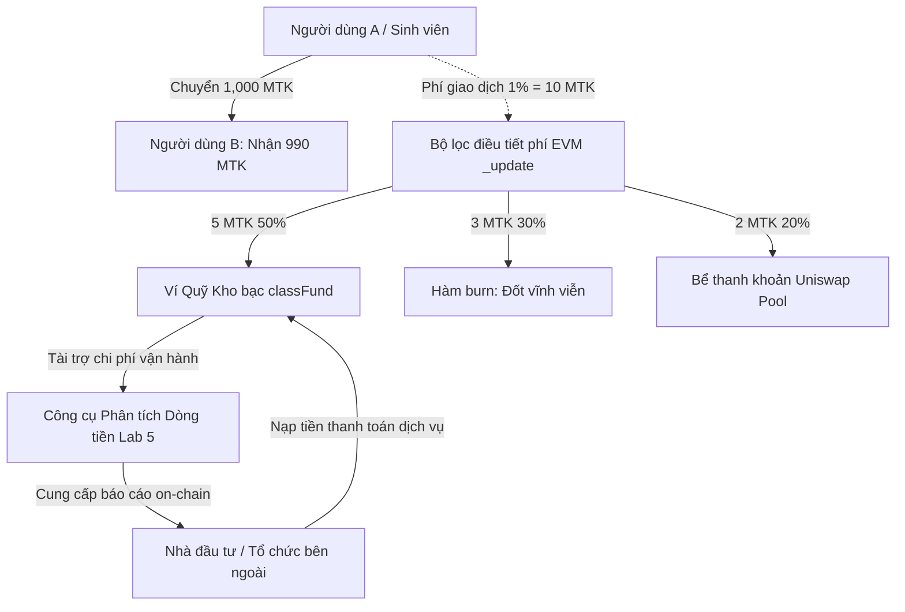

# QUY TẮC KINH TẾ VÀ ĐẶC TẢ DÒNG TIỀN — HỆ SINH THÁI MYTOKEN (MTK)

**Học phần:** Tiền điện tử và Hợp đồng thông minh (ECO2432)  
**Đơn vị:** Khoa Hệ thống Thông tin Kinh tế — Trường Đại học Kinh tế, Đại học Huế  
**Giảng viên phụ trách:** TS. Hà Ngọc Long  
**Quy chuẩn áp dụng:** Cấu trúc tiêu chuẩn Lab 5 & Lab 8 — Sổ tay Thực hành ECO2432  
**Hợp đồng thông minh lõi:** [MyToken.sol](file:///c:/SmartContractLab/contracts/MyToken.sol) (Solidity `^0.8.20`, OpenZeppelin v5.x)  

---

## 1. Đơn vị giá trị trong hệ thống

### 1.1. Bản chất và định danh tài sản
- **Tên tài sản:** MyToken
- **Ký hiệu mã hóa (Ticker):** `MTK`
- **Tiêu chuẩn kỹ thuật:** Token chuẩn ERC-20, tích hợp tiện ích đốt token (`ERC20Burnable`) và phân quyền quản trị (`Ownable`) tuân thủ OpenZeppelin Contracts v5.x.
- **Số chữ số thập phân (`decimals`):** 18 chữ số thập phân (đơn vị cơ sở nhỏ nhất là `wei`, tương thích hoàn toàn với máy ảo Ethereum EVM).
- **Vai trò kinh tế trong hệ thống:** 
  - Đóng vai trò là **Đơn vị thanh toán nội bộ (Internal Medium of Exchange)**: Sử dụng để chi trả phí dịch vụ nghiên cứu dữ liệu on-chain, mua sắm tài liệu chuyên ngành, sử dụng máy in và thanh toán tiện ích tại phòng máy Fintech / Căn tin trường học.
  - Đóng vai trò là **Tài sản khen thưởng đóng góp (Proof-of-Contribution / Reward Utility)**: Tích lũy điểm thưởng học tập, trợ giảng, nghiên cứu khoa học sinh viên (NCKH) và giải thưởng các cuộc thi học thuật.
  - Đóng vai trò là **Chứng chỉ hạn mức dịch vụ (Access Tier)**: Người nắm giữ lượng MTK nhất định được mở khóa quyền truy cập không giới hạn vào API phân tích dữ liệu dòng tiền on-chain cao cấp (Whale Tracking, Smart Money Alert).

### 1.2. Kế hoạch phát hành và phân bổ ban đầu (Initial Allocation)
- **Số lượng đúc ban đầu (Initial Supply):** $1.000.000\text{ MTK}$ ($1.000.000 \times 10^{18}$ wei), được đúc trực tiếp tại hàm khởi tạo `constructor()` của hợp đồng.
- **Giới hạn trần tổng cung tuyệt đối (Max Supply Cap):** $10.000.000\text{ MTK}$ ($10.000.000 \times 10^{18}$ wei). Đây là hằng số bất biến (`MAX_SUPPLY`), ngăn chặn tuyệt đối nguy cơ lạm phát vô hạn (bài học xương máu từ Hợp đồng B, Phụ lục I.2).
- **Phân bổ ban đầu của $1.000.000\text{ MTK}$ khởi chạy:**
  1. *40% ($400.000\text{ MTK}$)* — **Bể tạo lập thanh khoản ban đầu (Initial Liquidity Pool):** Ghép cặp với $2\text{ ETH}$ Sepolia trên sàn Uniswap V2 để tạo thị trường giao dịch mở.
  2. *30% ($300.000\text{ MTK}$)* — **Quỹ Học bổng & Khen thưởng Nghiên cứu (Ecosystem & Academic Fund):** Do Khoa HTTT Kinh tế và Hội sinh viên đồng quản lý, giải ngân thưởng theo học kỳ.
  3. *15% ($150.000\text{ MTK}$)* — **Quỹ Dự trữ Khẩn cấp & Bảo hiểm Thanh khoản (Treasury & Reserve):** Lưu trữ trong ví lạnh đa chữ ký (Multi-sig) để xử lý các biến cố kỹ thuật hoặc biến động tỷ giá.
  4. *15% ($150.000\text{ MTK}$)* — **Đội ngũ Sáng lập & Vận hành Kỹ thuật (Founding Team):** Khóa tuyến tính (Vesting) phục vụ duy trì và phát triển hạ tầng phần mềm.

```
       ┌─────────────────────────────────────────────────────────────┐
       │             TỔNG CUNG KHỞI TẠO: 1,000,000 MTK               │
       ├──────────────┬──────────────┬───────────────┬───────────────┤
       │  Thanh khoản │ Quỹ Học bổng │ Quỹ Dự trữ    │ Đội ngũ Dev   │
       │    Uniswap   │   & Nghiệp vụ│   Kho bạc     │   (Vesting)   │
       │     40%      │     30%      │     15%       │     15%       │
       │  (400,000)   │  (300,000)   │  (150,000)    │  (150,000)    │
       └──────────────┴──────────────┴───────────────┴───────────────┘
```

---

## 2. Nguồn thu và luồng chu chuyển dòng tiền (Cashflow Architecture)

### 2.1. Nguồn thu của hệ sinh thái (Inflow Sources)
Hệ thống tạo ra dòng tiền dương (Inflow) thông qua 3 kênh chính quy:
1. **Phí chu chuyển tài sản (Protocol Transfer Fee / Tax):**
   - Áp dụng mức phí $1,00\%$ ($100$ điểm cơ bản — basis points) trên mỗi lệnh chuyển token MTK giữa các ví thông thường.
   - Loại trừ miễn phí đối với ví Chủ sở hữu (`owner`), ví Quỹ kho bạc (`classFund`), và các đợt phát hành/đốt token.
2. **Doanh thu cung cấp dịch vụ phân tích dữ liệu on-chain (BaaS — Blockchain as a Service):**
   - Các tổ chức nghiên cứu bên ngoài, quỹ đầu tư thực tập sinh hoặc nhà giao dịch muốn truy xuất báo cáo phân tích dòng tiền chuyên sâu (Lab 5 Engine) phải trả phí bằng MTK hoặc Sepolia ETH.
3. **Phí dịch vụ thương mại trong khuôn viên trường học (Merchant Gateway Fee):**
   - Trích $0,5\%$ giá trị đơn hàng đối với các đối tác căn tin, quán photocopy, gian hàng sinh viên chấp nhận thanh toán bằng MTK.

### 2.2. Điểm đến và tỷ lệ điều tiết dòng tiền (Outflow & Distribution)
Mỗi đơn vị tiền thu được từ phí giao dịch ($100\text{ bps} = 1\%$) được tự động phân bổ theo công thức cơ cấu dòng tiền bền vững:
- **$50\%$ Phí thu được ($50\text{ bps}$):** Chuyển trực tiếp về **Ví Quỹ Kho bạc Học phần (`classFund`)** để tài trợ học bổng, mua sắm máy chủ RPC và tổ chức các sự kiện học thuật.
- **$30\%$ Phí thu được ($30\text{ bps}$):** Đưa vào **Cơ chế Đốt tự động (Deflationary Auto-Burn)** thông qua hàm `burn()`. Lượng token này bị loại bỏ vĩnh viễn khỏi lưu thông, trực tiếp làm giảm tổng cung, tạo áp lực tăng giá trị cho các token còn lại.
- **$20\%$ Phí thu được ($20\text{ bps}$):** Phân phối bổ sung vào **Bể Thanh khoản (Auto-Liquidity Provision)** để làm dày thanh khoản thị trường, hạn chế trượt giá (slippage).

### 2.3. Mô hình chu chuyển dòng tiền khép kín (Circular Cashflow Model)



### 2.4. Đặc tả dòng tiền phục vụ Công cụ Phân tích Lab 5 (Cashflow Specifications)
Để công cụ phân tích dòng tiền on-chain (Lab 5) có thể truy vết và lập báo cáo tài chính chính xác cho bất kỳ ví nào trong hệ sinh thái trong chu kỳ 90 ngày, các quy tắc hạch toán dòng tiền được chuẩn hóa như sau:
- **Dòng tiền vào (Cash Inflow):** Khi `to == targetWallet`. Số tiền ghi nhận $= \text{Value}$ thực nhận sau khi đã trừ phí hệ sinh thái (nếu có).
- **Dòng tiền ra (Cash Outflow):** Khi `from == targetWallet`. Số tiền ghi nhận $= \text{Value chuyển đi} + \text{Phí giao dịch EVM (Gas Fee)}$.
- **Hạch toán giao dịch thất bại:** Các giao dịch có `Status == Fail` không làm thay đổi số dư token, nhưng **phí gas ETH tiêu tốn vẫn bắt buộc phải hạch toán vào dòng tiền ra** theo đúng nguyên tắc kế toán tài sản số (chuẩn Lab 3 và Lab 5, quy tắc R4).
- **Chuẩn hóa đơn vị đo lường:** Toàn bộ dữ liệu dòng tiền trích xuất từ Blockchain RPC ở dạng số nguyên lớn (`wei`) phải được chia cho $10^{18}$ trước khi tổng hợp số dư lũy kế (Cumulative Balance) và dựng biểu đồ trực quan hóa.

---

## 3. Quy tắc chống lạm dụng (Anti-Exploit & Abuse Protection)

Để triệt tiêu các hành vi đầu cơ, lũng đoạn giá và phá hoại hệ thống kinh tế vi mô, dự án thiết lập 4 tầng phòng vệ tự động ở cấp độ hợp đồng thông minh:

### Quy tắc 1: Khống chế trần nắm giữ tối đa trên mỗi ví (Max Holding Cap)
- **Thông số:** Mỗi địa chỉ ví cá nhân chỉ được phép sở hữu tối đa **$2,00\%$ tổng cung lưu hành** (tương đương $200.000\text{ MTK}$ tại thời điểm khởi tạo).
- **Cơ chế kỹ thuật:** Tại hàm hook `_update(address from, address to, uint256 value)`:
  ```solidity
  if (to != address(0) && to != classFund && to != owner()) {
      if (balanceOf(to) > maxHolding) {
          revert ExceedsMaxHolding(balanceOf(to), maxHolding);
      }
  }
  ```
- **Ý nghĩa kinh tế:** Ngăn chặn một "cá voi" (Whale) thâu tóm quá nhiều nguồn cung nhằm thao túng giá trên thị trường thứ cấp hoặc chi phối các cuộc biểu quyết cộng đồng.

### Quy tắc 2: Giới hạn khối lượng giao dịch tối đa mỗi lệnh (Max Transaction Limit)
- **Thông số:** Mỗi lệnh chuyển token đơn lẻ không được vượt quá **$0,50\%$ tổng cung** (tương đương tối đa $50.000\text{ MTK}$/giao dịch).
- **Ý nghĩa kinh tế:** Chặn đứng các đợt "xả hàng hoảng loạn" (Flash Dump) đột ngột làm sập thanh khoản bể chứa, bảo vệ các nhà đầu tư nhỏ lẻ khỏi trượt giá tiêu cực.

### Quy tắc 3: Cơ chế đóng băng tài khoản tuân thủ AML/CFT (Blacklist / Freeze)
- **Cơ chế kỹ thuật:** Tích hợp biến trạng thái `mapping(address => bool) public isFrozen`.
- **Hành vi chặn kép:** Khi ví bị đóng băng (`isFrozen[account] == true`), hợp đồng tự động chặn triệt để:
  - Chiều gửi đi: Không thể gọi `transfer()`, `transferFrom()`, hay tự hủy `burn()`.
  - Chiều nhận vào: Không thể nhận token từ người khác hoặc nhận token đúc từ hàm `mint()`.
- **Ý nghĩa tuân thủ:** Ngăn chặn dòng tiền bẩn (tiền từ các vụ hack, ví lừa đảo, ví vi phạm quy chế đào tạo) xâm nhập và rửa qua hệ thống tài chính nội bộ.

### Quy tắc 4: Khóa thời gian giải ngân Kho bạc (Timelock Vault for Treasury)
- **Thông số:** Mọi khoản chi ngân sách từ Quỹ Kho bạc có giá trị $> 10.000\text{ MTK}$ phải được kích hoạt thông qua hợp đồng khóa thời gian (`TimeLockVault`) với độ trễ tối thiểu **48 giờ** trước khi tiền được chuyển ra ngoài.
- **Ý nghĩa quản trị:** Cho phép toàn thể cộng đồng sinh viên và nhà đầu tư có đủ thời gian giám sát dữ liệu on-chain và chất vấn ban quản trị trước khi các quyết định chi tiêu lớn có hiệu lực.

---

## 4. Quyền của người quản trị và Phân tích Rủi ro tập trung

### 4.1. Danh mục quyền hạn tối cao của Chủ sở hữu (`onlyOwner`)
Người quản trị hợp đồng (Deployer / Admin) hiện nắm giữ 3 đặc quyền cốt lõi có khả năng can thiệp trực tiếp vào trạng thái số cái:
1. **Quyền đúc thêm token (`mint(address to, uint256 amount)`):**
   - Chủ sở hữu có thể phát hành thêm token mới cho bất kỳ ví nào, miễn là $\text{totalSupply} + \text{amount} \le 10.000.000\text{ MTK}$.
2. **Quyền đóng băng tài khoản (`freezeAccount(address account)`):**
   - Đơn phương đình chỉ quyền sở hữu và chuyển nhượng tài sản của bất kỳ địa chỉ ví nào trong hệ thống mà không cần người đó đồng thuận.
3. **Quyền mở khóa tài khoản (`unfreezeAccount(address account)`):**
   - Phục hồi lại quyền giao dịch bình thường cho các ví sau khi đã hoàn tất xác minh tuân thủ hoặc khiếu nại thành công.

### 4.2. Kịch bản thảm họa: Mất khóa bảo mật hoặc Người quản trị có ý đồ xấu (Worst-Case Analysis)

| Tình huống rủi ro | Cơ chế kích hoạt trên mã nguồn | Hậu quả trực tiếp đối với người dùng | Mức độ thiệt hại |
| :--- | :--- | :--- | :---: |
| **Bị lộ khóa bí mật (Private Key Compromised)** | Kẻ tấn công chiếm đoạt ví admin, gọi hàm `mint()` đúc kịch trần $9.000.000\text{ MTK}$ còn lại. | Kẻ trộm xả toàn bộ $9$ triệu token lên sàn DEX, rút sạch toàn bộ ETH thanh khoản. Giá MTK rơi tự do về $0$, toàn bộ người nắm giữ mất sạch vốn. | **Thảm họa (100% tài sản)** |
| **Quản trị viên lạm quyền trả thù cá nhân** | Admin gọi hàm `freezeAccount(victimWallet)` đối với ví của nhà đầu tư lớn hoặc sinh viên bất đồng chính kiến. | Nạn nhân bị tịch thu quyền thanh khoản tài sản, token bị giam vĩnh viễn trong ví mà không có cơ chế tòa án trên chuỗi để tự vệ. | **Nghiêm trọng (Mất tính thanh khoản)** |
| **Mất khóa ví vĩnh viễn (Key Loss)** | Admin làm mất 12 từ khôi phục (Seed Phrase) hoặc thiết bị lưu trữ bị hỏng. | Hợp đồng bị "mồ côi" quản trị: Không thể đúc thêm token trả học bổng, không thể mở khóa cho các ví bị chặn nhầm, các tham số kinh tế bị đóng băng vĩnh viễn. | **Nghiêm trọng (Tắc nghẽn vận hành)** |

---

## 5. Phản biện và trả lời

Dưới đây là phần tự phản biện dự án được thực hiện nghiêm ngặt theo **Phụ lục II.6 — Sổ tay Thực hành ECO2432**, đóng vai trò là một **Nhà đầu tư Thận trọng và Khắt khe** trong lĩnh vực công nghệ tài chính phi tập trung (DeFi).

### 5.1. Năm phản biện của Nhà đầu tư thận trọng (Xếp theo mức độ rủi ro giảm dần)

```
[BẮT ĐẦU NGUYÊN VĂN 5 ĐIỂM YẾU DO NHÀ ĐẦU TƯ THẬN TRỌNG ĐẶT RA]
```

#### Phản biện 1: Điểm nghẽn tập quyền tuyệt đối của Private Key Quản trị (Admin Single Point of Failure) & Nguy cơ "Rug Pull" / Đóng băng vô căn cứ
- **Mức độ rủi ro:** **Thảm họa / Cực kỳ nghiêm trọng (Critical Risk)**
- **Mô tả điểm yếu:** Toàn bộ quyền sinh sát của dự án gồm đúc thêm tới $9.000.000\text{ MTK}$ (hàm `mint`) và đóng băng bất kỳ ví người dùng nào (hàm `freezeAccount`) đều phụ thuộc vào một ví EOA cá nhân duy nhất (`onlyOwner`). Hợp đồng hoàn toàn thiếu vắng cơ chế Đa chữ ký (Multi-sig) và Khóa hoãn thời gian (Timelock Controller).
- **Tình huống người dùng bị thiệt hại:** Nếu máy tính của nhà phát triển bị nhiễm mã độc đánh cắp khóa bí mật, kẻ tấn công sẽ gọi hàm `mint()` đúc trọn vẹn $9.000.000\text{ MTK}$ còn lại ra một ví phụ, sau đó đồng loạt xả thẳng vào bể thanh khoản Uniswap để rút cạn toàn bộ ETH bảo chứng. Cùng lúc đó, hắn gọi `freezeAccount()` lên ví của toàn bộ các nhà đầu tư lớn để ngăn họ thoát hàng. Kết quả: Toàn bộ người nắm giữ token thức dậy thấy tài sản bị khóa cứng, giá token bốc hơi $99,99\%$, mất trắng toàn bộ vốn liếng mà không có bất kỳ kênh pháp lý nào hỗ trợ.

#### Phản biện 2: Phân phối nguồn cung ban đầu quá tập trung (Initial Supply Monopoly) và Thiếu lịch trình Khóa vốn (Vesting Schedule)
- **Mức độ rủi ro:** **Rất cao (High Risk)**
- **Mô tả điểm yếu:** Toàn bộ $1.000.000\text{ MTK}$ khởi tạo ban đầu được chuyển thẳng vào ví người triển khai (`msg.sender`) trong hàm `constructor`. Không có hợp đồng thông minh độc lập nào cưỡng chế lịch trình khóa vốn (Vesting Lock) cho đội ngũ phát triển.
- **Tình huống người dùng bị thiệt hại:** Sau khi dự án niêm yết trên Uniswap và thu hút hàng trăm sinh viên, nhà đầu tư nạp tiền thật vào mua đẩy vốn hóa token lên cao, đội ngũ sáng lập có thể âm thầm chuyển $500.000\text{ MTK}$ từ ví Deployer lên sàn bán chốt lời. Áp lực bán khổng lồ đột ngột khiến giá token sụp đổ $85\%$. Đội ngũ có thể thoái thác trách nhiệm bằng lý do "ví bị hack" hoặc "bán ra để trang trải chi phí nghiên cứu", bỏ mặc người mua nhỏ lẻ chịu lỗ.

#### Phản biện 3: Quy tắc Trần nắm giữ (Max Holding Cap 2%) hoàn toàn bất lực trước Tấn công mạo danh (Sybil Attack)
- **Mức độ rủi ro:** **Cao (Medium-High Risk)**
- **Mô tả điểm yếu:** Giới hạn nắm giữ tối đa $2\%$ tổng cung trên mỗi ví (`maxHolding`) chỉ là một phép so sánh địa chỉ ví đơn thuần ở tầng EVM (`balanceOf(to) <= maxHolding`). Trên blockchain công khai như Ethereum, bất kỳ ai cũng có thể tạo lập hàng trăm địa chỉ ví mới hoàn toàn miễn phí và không cần danh tính. (Đúng theo bẫy nhận thức tại câu trắc nghiệm E5, trang 55).
- **Tình huống người dùng bị thiệt hại:** Một đối tượng đầu cơ độc hại sử dụng bot tự động tạo ra 25 địa chỉ ví khác nhau, chia nhỏ tiền và gom mỗi ví $1,8\%$ tổng cung (vừa vặn lách qua trần $2\%$). Tổng cộng kẻ này âm thầm kiểm soát tới $45\%$ nguồn cung lưu hành. Người dùng phổ thông tin tưởng vào dòng quảng cáo *"Hệ thống có cơ chế chống cá voi độc quyền 2%"* nên an tâm bỏ vốn. Khi gom đủ lượng, kẻ thao túng xả token đồng loạt từ 25 ví trong vòng 2 phút, gây trượt giá nghiêm trọng, kích hoạt làn sóng bán tháo hoảng loạn rồi dùng tiền mặt thâu tóm lại toàn bộ lượng bán ra ở mức giá rác.

#### Phản biện 4: Cơ chế Thu phí Giao dịch (Transfer Tax 1%) phá vỡ Tính tương thích chuẩn DeFi (Break Composability)
- **Mức độ rủi ro:** **Trung bình (Medium Risk)**
- **Mô tả điểm yếu:** Logic thu phí $1\%$ bằng cách can thiệp vào hàm `_update` biến `MyToken` thành token dạng **"Fee-on-Transfer"**. Rất nhiều giao thức DeFi chuẩn mực (như Router Uniswap V2 tiêu chuẩn, hợp đồng Két ký quỹ Escrow, hoặc các bể Lending Aave/Compound) giả định rằng: `Số token chuyển đi = Số token nhận được`.
- **Tình huống người dùng bị thiệt hại:** Một sinh viên nạp $10.000\text{ MTK}$ vào hợp đồng Ký quỹ mua bán đồ cũ (`SimpleEscrow.sol` của Lab 12) hoặc cung cấp thanh khoản trên sàn DEX. Vì cơ chế thu phí $1\%$, hợp đồng ký quỹ chỉ thực nhận $9.900\text{ MTK}$, nhưng biến trạng thái trong hợp đồng lại ghi nhận số dư của người đó là $10.000\text{ MTK}$. Khi giao dịch mua bán hoàn tất hoặc khi người dùng muốn rút tiền ra, hàm rút tiền gọi lệnh chuyển $10.000\text{ MTK}$ nhưng số dư thực tế của hợp đồng chỉ có $9.900\text{ MTK}$. Lệnh chuyển tiền bị `revert` vĩnh viễn do lỗi thiếu số dư, khiến $9.900\text{ MTK}$ của người dùng bị giam chết trong hợp đồng thông minh mà không ai có thể giải cứu.

#### Phản biện 5: Tốc độ chu chuyển quá nhanh (High Token Velocity) và Thiếu Dòng tiền thực tế Ngoại sinh (Lack of External Real Yield)
- **Mức độ rủi ro:** **Trung bình - Đáng kể (Low-Medium Risk)**
- **Mô tả điểm yếu:** Mô hình kinh tế token hiện tại chỉ dựa trên các tiện ích nội bộ (đổi quà, giảm giá trong trường) mà không có nguồn thu bằng dòng tiền thực (fiat/ETH ngoại sinh) chảy vào bảo chứng Kho bạc. Khi người dùng nhận được token thưởng, động lực duy nhất của họ là mang đi chi tiêu ngay hoặc bán ra lấy tiền mặt, tạo nên hiện tượng tốc độ chu chuyển token quá cao mà không có lực giữ (Lack of Value Sink).
- **Tình huống người dùng bị thiệt hại:** Sinh viên tích cực đóng góp công sức nghiên cứu suốt cả học kỳ và tích lũy được $5.000\text{ MTK}$. Tuy nhiên, vào tuần thi cuối kỳ, hàng trăm sinh viên khác cũng đồng loạt mang MTK đi đổi nước uống tại căn tin hoặc bán lấy tiền mặt. Vì Kho bạc không có dự trữ tiền thật ngoại sinh để hấp thụ lượng bán này, giá trị quy đổi của MTK sụp đổ từ $1.000\text{ VNĐ}$ xuống còn $20\text{ VNĐ}$/token. Toàn bộ công sức cống hiến học thuật của sinh viên bị bốc hơi giá trị chỉ trong vài ngày.

```
[KẾT THÚC NGUYÊN VĂN 5 ĐIỂM YẾU]
```

---

### 5.2. Trả lời chi tiết và Phương án xử lý của Đội ngũ Dự án

Đối diện trực tiếp với 5 phản biện sắc bén của Nhà đầu tư thận trọng, Đội ngũ dự án xin làm rõ căn cứ chấp nhận rủi ro và cam kết lộ trình kỹ thuật khắc phục triệt để như sau:

#### Trả lời Phản biện 1: Xử lý rủi ro Điểm nghẽn Quản trị Admin Key
- **Căn cứ hiện tại:** Việc sử dụng một ví EOA `onlyOwner` trong giai đoạn hiện tại là giải pháp chấp nhận có chủ đích nhằm phục vụ mục tiêu học tập, thử nghiệm và sửa lỗi nhanh trên mạng Sepolia Testnet của môn học ECO2432.
- **Phương án xử lý kỹ thuật dứt điểm (Production Roadmap):**
  1. *Chuyển giao quyền sở hữu sang Ví Đa chữ ký (Gnosis Safe Multi-sig):* Trước khi triển khai lên môi trường sản xuất, quyền `owner` của hợp đồng sẽ được chuyển giao vĩnh viễn cho một ví Multi-sig với cấu hình $3/5$ chữ ký đại diện (gồm: Đại diện Ban chủ nhiệm Khoa, Giảng viên phụ trách, Bí thư Đoàn trường, và 2 đại diện sinh viên được bầu chọn). Không một cá nhân đơn lẻ nào có thể tự ý gọi `mint()` hoặc `freezeAccount()`.
  2. *Tích hợp Hợp đồng Hoãn lệnh (OpenZeppelin TimelockController):* Thiết lập thời gian hoãn thi hành bắt buộc **48 giờ** đối với mọi giao dịch gọi hàm `mint()` và `freezeAccount()`. Khi một lệnh nhạy cảm được đưa vào hàng đợi (Queue), sự kiện on-chain sẽ phát ra ngay lập tức. Công cụ phân tích dòng tiền Lab 5 sẽ gửi cảnh báo tức thì cho toàn bộ người dùng, cho phép cộng đồng có 48 giờ để rút vốn nếu phát hiện hành vi lạm quyền bất minh.

#### Trả lời Phản biện 2: Xử lý rủi ro Đội ngũ Sáng lập Xả hàng Nguồn cung Ban đầu
- **Căn cứ chấp nhận rủi ro:** Trong phạm vi môn học, lượng token ban đầu được Deployer giữ tạm thời để phân phát token thực nghiệm cho các nhóm sinh viên trong lớp học.
- **Phương án xử lý kỹ thuật dứt điểm:**
  1. *Áp dụng Hợp đồng Khóa vốn tự động (`TokenVesting.sol` của OpenZeppelin):* Toàn bộ $15\%$ nguồn cung của Đội ngũ sáng lập ($150.000\text{ MTK}$) bắt buộc phải chuyển vào hợp đồng `TokenVesting` với thời gian khóa cứng (Cliff) là 6 tháng, sau đó giải ngân tuyến tính (Linear Vesting) đều đặn trong vòng 18 tháng tiếp theo.
  2. *Khóa thanh khoản DEX (Liquidity Pool Lock):* Token thanh khoản LP nhận được từ Uniswap ($400.000\text{ MTK} + 2\text{ ETH}$) sẽ được gửi vào hợp đồng khóa thanh khoản độc lập (như UNCX Network / PinkLock) với thời hạn tối thiểu 12 tháng, bảo đảm nhà đầu tư không bao giờ bị rút cạn thanh khoản (Anti-Rug Pull).

#### Trả lời Phản biện 3: Xử lý rủi ro Tấn công Mạo danh Phân tán (Sybil Attack)
- **Căn cứ chấp nhận rủi ro:** Thừa nhận một nguyên lý tột cùng của công nghệ Blockchain: *Quy tắc kỹ thuật thuần túy trên EVM không thể thay thế được cơ chế định danh ngoài đời thực* (Bài học cốt lõi từ TS. Long tại Câu trắc nghiệm E5). Việc tạo ví trên chuỗi luôn là ẩn danh (Pseudonymous).
- **Phương án xử lý kết hợp On-chain & Off-chain:**
  1. *Ràng buộc Danh tính thông qua hợp đồng `StudentRegistry.sol`:* Để nhận được quyền lợi kinh tế thực tế (như chiết khấu căn tin, nhận học bổng, bỏ phiếu), địa chỉ ví bắt buộc phải được kích hoạt trạng thái KYC nội bộ thông qua hợp đồng [StudentRegistry.sol](file:///c:/SmartContractLab/contracts/StudentRegistry.sol) (mỗi Mã sinh viên / Căn cước công dân chỉ được liên kết duy nhất 1 địa chỉ ví on-chain theo chuẩn EIP-55).
  2. *Cấp phát Soulbound Token (SBT) định danh:* Triển khai hợp đồng chuẩn ERC-721 Soulbound (theo mẫu M.5 trong Sổ tay). Chỉ những ví sở hữu SBT sinh viên chính chủ mới được nhận quyền lợi từ các chương trình phân phối token, vô hiệu hóa hoàn toàn âm mưu tạo hàng loạt ví bot để gom hàng.
  3. *Hệ thống Giám sát Phân tích Dòng tiền (Lab 5 Engine):* Công cụ phân tích dòng tiền sẽ tích hợp thuật toán gom nhóm ví (Wallet Clustering) dựa trên dấu vết chuyển phí gas ban đầu để phát hiện và cảnh báo các mạng lưới ví Sybil hoạt động cùng một cụm.

#### Trả lời Phản biện 4: Xử lý rủi ro Xung đột Phí giao dịch (Fee-on-Transfer) và Tương thích DeFi
- **Căn cứ chấp nhận rủi ro:** Thu phí là cần thiết để duy trì Quỹ học bổng và vận hành cơ chế đốt token giảm phát.
- **Phương án xử lý kỹ thuật dứt điểm:**
  1. *Danh sách Miễn trừ phí thông minh (`mapping(address => bool) public isFeeExempt`):* Thiết lập hàm cấp quyền miễn trừ phí cho các địa chỉ hợp đồng tiêu chuẩn đã được kiểm toán (như Uniswap V2 Pair/Router, các hợp đồng Vault ký quỹ `SimpleEscrow.sol`). Khi tương tác với các hợp đồng này, phí giao dịch bằng $0\%$, bảo đảm `Số tiền gửi = Số tiền nhận`, triệt tiêu hoàn toàn rủi ro kẹt tiền.
  2. *Hỗ trợ giao diện Router đặc thù:* Khi niêm yết trên DEX, hệ sinh thái sẽ chỉ dẫn người dùng sử dụng các hàm chuyên biệt của Uniswap dành riêng cho token có phí: `swapExactTokensForTokensSupportingFeeOnTransferTokens()`.
  3. *Tách rời phí dịch vụ lên tầng Ứng dụng (DApp Layer):* Trong phiên bản nâng cấp V2, nhóm sẽ cân nhắc loại bỏ phí trực tiếp tại hàm `_update` của token ERC-20 và chuyển sang thu phí ở tầng hợp đồng dịch vụ (Service Contract), giữ cho token MTK nguyên bản $100\%$ chuẩn mực ERC-20 nhằm tương thích hoàn hảo với toàn bộ hệ sinh thái DeFi thế giới.

#### Trả lời Phản biện 5: Xử lý rủi ro Tốc độ chu chuyển cao và Thiếu Nguồn thu Ngoại sinh
- **Căn cứ chấp nhận rủi ro:** Trong giai đoạn đầu, dự án cần chấp nhận phát hành token thưởng để kích thích người dùng mới làm quen với sản phẩm (Growth Bootstrapping).
- **Phương án xử lý kinh tế thực tiễn (Real Yield & Economic Sink):**
  1. *Mô hình Mua lại và Đốt (Buyback-and-Burn từ Doanh thu thật):* Quỹ Kho bạc cam kết sử dụng $40\%$ doanh thu tiền mặt thực tế từ dịch vụ bản quyền API phân tích dữ liệu on-chain và hoa hồng căn tin để định kỳ mua lại token MTK trên thị trường tự do rồi chuyển vào địa chỉ `0x000000000000000000000000000000000000dEaD` để đốt. Dòng tiền thật từ bên ngoài sẽ bơm trực tiếp vào làm tăng giá trị nội tại cho token.
  2. *Cơ chế Khóa Staking nhận Cổ tức Dòng tiền (Staking for Real Yield):* Người dùng khóa MTK vào hợp đồng Két tiết kiệm có khóa thời gian (`TimeLockVault.sol` của Lab 9) trong 3 tháng, 6 tháng hoặc 12 tháng không chỉ được giảm tốc độ chu chuyển token trên thị trường, mà còn được nhận cổ tức phân phối định kỳ bằng chính đồng Sepolia ETH thu được từ phí dịch vụ của hệ thống. Đây chính là "điểm neo kinh tế" giữ chân người dùng dài hạn.

---

## 6. Tổng kết và Cam kết Liêm chính Thiết kế

Bản đặc tả kinh tế `tokenomics.md` này thể hiện tinh thần cốt lõi của môn học **ECO2432**: *Một sản phẩm tài sản số thành công không nằm ở việc viết mã nguồn Solidity phức tạp, mà nằm ở tư duy thiết kế cơ chế kinh tế vững chắc, thấu hiểu quy luật cung cầu, nhận thức sâu sắc các cạm bẫy tập quyền và chủ động phòng ngừa rủi ro cho người dùng cuối.* Toàn bộ các cam kết kỹ thuật trên sẽ được cụ thể hóa trong các bài thực hành tiếp theo của học phần.
